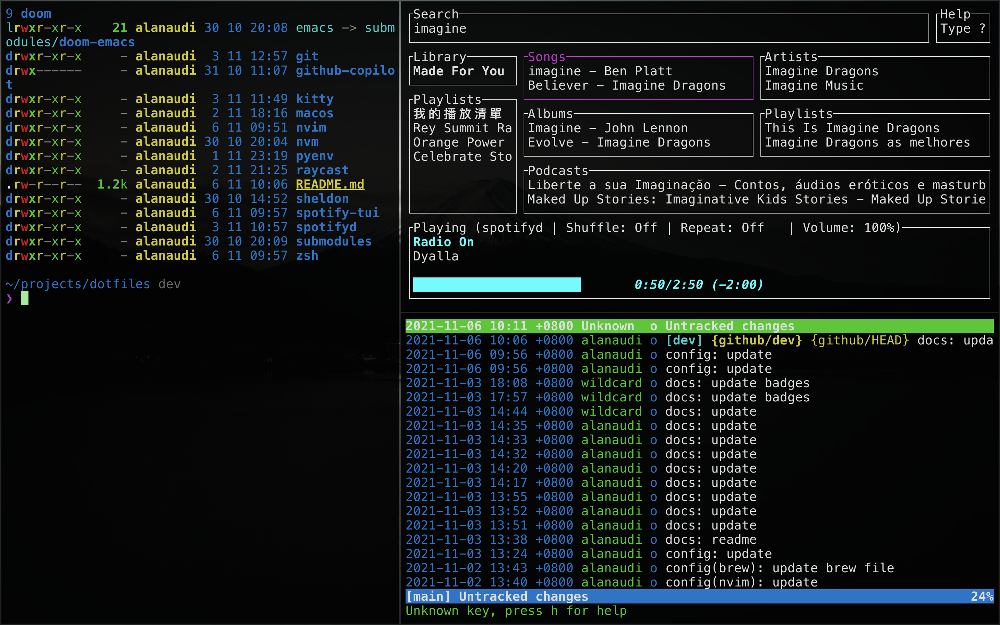

<h1 align="center">Dotfiles All in One</h1>

  
  
  
  
  
  

<h2 id="cli" align="center">Command Line</h2>

- [exa](https://github.com/ogham/exa) : a modern replacement for `ls`.

<h2 id="spotify" align="center">Spotify</h2>

- [spotifyd](https://github.com/Spotifyd/spotifyd) : command line backend
- [spotify-tui](https://github.com/Rigellute/spotify-tui) : command line client
